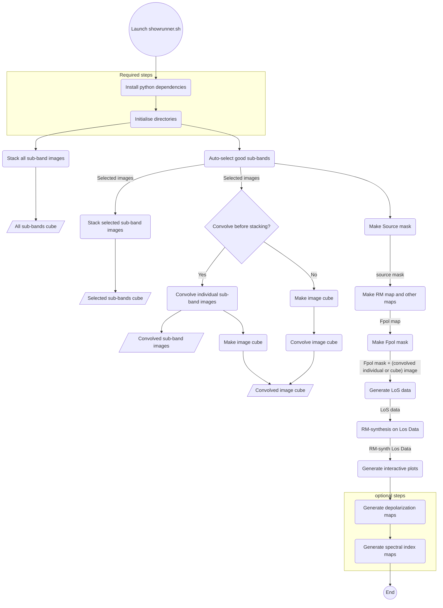

## showrunner

A Bash-based pipeline taking in sub-band Stokes images and generates various spectrapolarimetric analysis and visualisation data products.

<!-- ::: ./posta/showrunner
    handler: shell
    options:
      show_source: true -->


1. what cmd line tools and software are used here
2. the steps this pipeline takes
3. What are the outputs of each steps /and the inputs also
3b. Specify that inputs are from wsclean images
4. A graphic showing the flow of this pipeline

5. What are the system/setup requirements

-----
### Setup
This pipeline runs within the Linux shell environment. It has been tested using:

- Ubuntu 22.04
- Python 3.10
- Bash 5.1.16

-----
### Software
Disparate software -- both native to Linux and external Python software -- are used within this pipeline to achieve its goals. The following table summarises the software used (including scrappy).

| Software      |  Tool               | Description |
|---------------|---------------------|-------------|
| [`montagePy`](https://github.com/Caltech-IPAC/Montage)   | `fitsheader`        | Read FITS headers |
| [`owlcat`](https://github.com/ratt-ru/owlcat)      | `fitstool.py`       | Creating Stokes cubes |
| [`spimple`](https://github.com/landmanbester/spimple)     | `spimple-imconv`    | Image convolution to the same beam |
|               | `spimple-spifit`    | Spectral index fitting |
| `scrappy`     | `sc-beam-plot`      | Channel auto-selection and beam dimension plotting |
|               | `sc-rmmap`          | Generate per-pixel RM maps among other things |
|               | `sc-los`            | Generate independent LoS |
|               | `sc-los-rm`         | Perform RM-synthesis on LoS from `scrappy` |
|               | `sc-bokehplots`     | Generate interactive plots for the LoS |
|               | `sc-houdini`        | Generate simple image masks given input images |
| Native Linux  | `cp`                | Copy files and folders |
|               | `ls`                | Listing files and folders |
|               | `sed`               | For some text processing |
|               | `mv`                | Moving and renaming files |
|               | `rm`                | Deleting files and folders |
|               | `rename(.ul)`       | Batch file renaming |


-----
### Output Directory Structure
```
├── masks                           # Location of the generated FITS masks
├── products
│   ├── conv-selection-cubes        # Location of the selected sub-band images' cubes convolved to the same resolution
│   ├── original-cubes              # Location of the full band images' cubes
│   ├── selection-cubes             # Location of selected images' cubes
    ├── scrap-outputs               # Outputs from s
│   │   ├── bokeh-plots             # Interactive plots generated by sc-bokeh-plots from sc-los-rm
│   │   ├── los-data                # LoS data outputs generated by sc-los
│   │   ├── los-rm-data             # LoS data outputs generated by sc-los-rm
│   │   ├── los-rm-data-plots       # Static plots generated by sc-los-rm
│   │   └── regions                 # Location of region files autoselected by sc-los
│   └── spi-fitting                 # Location of the spectral index fitter outputs
├── relevant-images                 # Location of the selected images
└── relevant-images-conv            # Location of the singular sub-band images convolved to the same resolution
```


----
### Pipeline flow illustration
----
